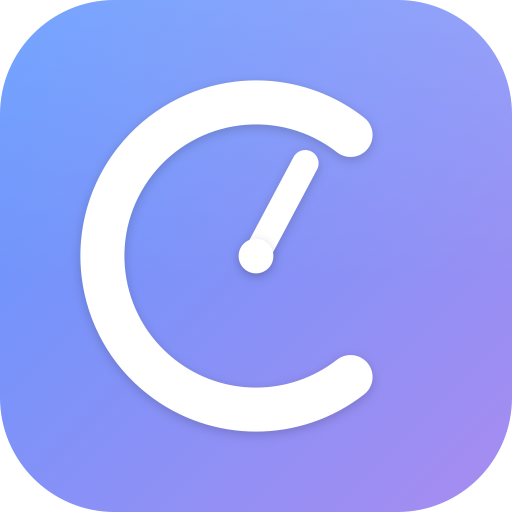

<p align="center">
  
</p>

<h1 align="center">Clessira for Raycast</h1>

<p align="center">
  <a href="https://clessira.app"></a>
  <a href="LICENSE"></a>
</p>

Start, stop, and log time in the [Clessira](https://clessira.app) macOS app
straight from Raycast — no need to open the menu bar popover.

Requires the Clessira macOS app. The extension talks to a Unix-domain socket
inside the app's sandbox container and never sends data over the network.

## Commands

- **Start Activity** — type-ahead search over your activities; start one, or
  create-and-start a new activity when there's no match.
- **Stop Tracking** — stop the currently tracked activity (idempotent).
- **Log Entry** — pick an activity, then log a fixed-duration entry with an
  optional note.
- **Status / Today** — show the current tracking state and today's total;
  refresh with `⌘R`, stop tracking inline.

## How it works

Clessira exposes an HMAC-signed loopback API (`BranchChangeServer`). When the
integration is enabled, the Mac app writes a capability file to:

```
~/Library/Containers/com.mattes.nowdoing/Data/api-endpoint.json
```

The extension reads the Unix-domain socket path and shared token from that file
(zero-config discovery — the same mechanism the
[VS Code extension](https://github.com/Clessira/vscode) uses), then signs each
request with HMAC-SHA256 plus a timestamp and nonce. There is no network port
and no token to copy.

The signing scheme and wire types are kept in lockstep with the Swift app and
the first-party [SDKs](https://github.com/Clessira/sdk). The published
`@clessira/sdk` is **not** used as a dependency: it is TCP/`fetch`-only and has
no Unix-domain-socket transport, so it cannot do the zero-config UDS discovery
this extension relies on. The protocol code here mirrors the SDK's auth
canonical and type shapes instead.

## Requirements

- macOS with the Clessira app installed and unlocked.
- The loopback API integration enabled in Clessira (Settings → HTTP-API).

If Clessira is not reachable, each command shows a hint to open the app and
enable the integration.

## Development

```sh
npm install
npm run dev      # ray develop — hot-reloads into Raycast
npm run lint
npm run build
```

Source layout:

- `src/lib/` — self-contained API client: `capability.ts` (discovery),
  `auth.ts` (HMAC signing), `client.ts` (UDS transport + typed endpoints),
  `types.ts`, `errors.ts`, `format.ts`, `feedback.ts`.
- `src/*.tsx` — one file per command (`start-activity`, `stop-tracking`,
  `log-entry`, `status`).

## License

[MIT](LICENSE) © Clessira
